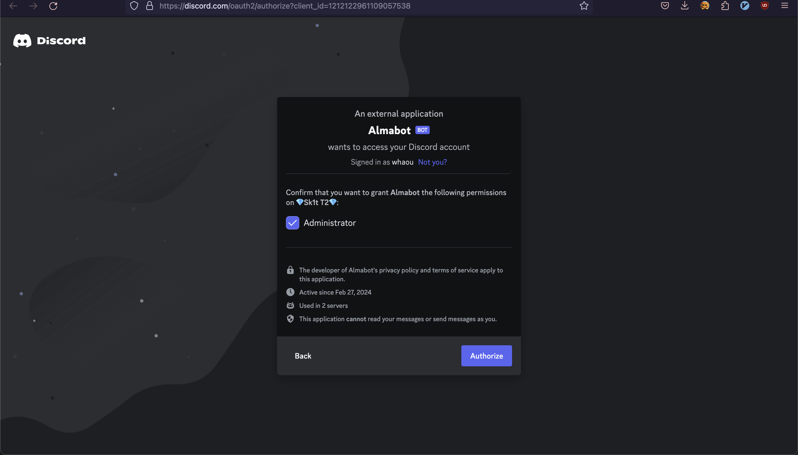
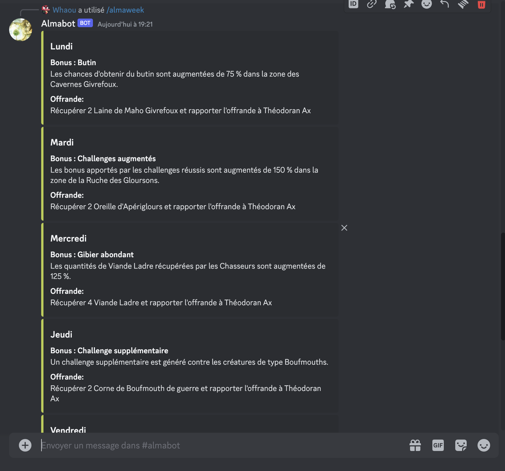

# Almabot !

This project is a Discord bot designed to help users get the Almanax offerings for the current day, week, or even the next week.
The Almanax is a daily quest in the MMORPG [Dofus](https://www.dofus.com/en), where each day you need to offer an item to a different god.
If you complete the quest every day for a year (365 times), you will receive a precious dragon egg!

## Why ?

It's annoying to log in to the game every day, start the quest, go to the nearest shop to buy the required item,
and then return to the temple to give the offering to the daily god. I wanted something that could provide
the Almanax offerings for the entire week so I can buy all the needed items in advance and speed up the process.
I chose to create a Discord bot instead of a script so that my friends and guildmates can use it too.

## 🚀 Quickstart

Use this [link](https://discord.com/oauth2/authorize?client_id=1212122961109057538)

choose the server you want to install the bot on then click on continue



and for finish click on authorize

then you can type `/almanax` to get the daily offering or `/almaweek` to get the almanax for the whole week!

## Availables commands

``/almanax``


You can also pick a date with day / month arguments

Ex: ``/almanax 28 07``


``/almatomorow`` (same as almanax is just return the almanax for tomorow)

``/almaweek``



get almanax for the whole current week

``/almanextweek`` (Same as almaweek but start at the next coming monday)


``/dolmanax $pages`` Gives you the date you obtained your precious Dolmanax.

⚠️  $page is an mandatory argument for the commands you need to give the number of pages you got. You can find it here:


## 🤝 Contributing

### Clone the repo

```bash
git clone https://github.com/macrespo42/Almabot
cd Almabot
```

### Build the project

```bash
npm install
```

### Run the project

```bash
npm run start
```

or if you want to self host it

```bash
npm run deploy:prod
```

### Submit a pull request

If you'd like to contribute, please fork the repository and open a pull request to the `main` branch.

## Contact

Need to contact me ? maxime.crespo@protonmail.com
