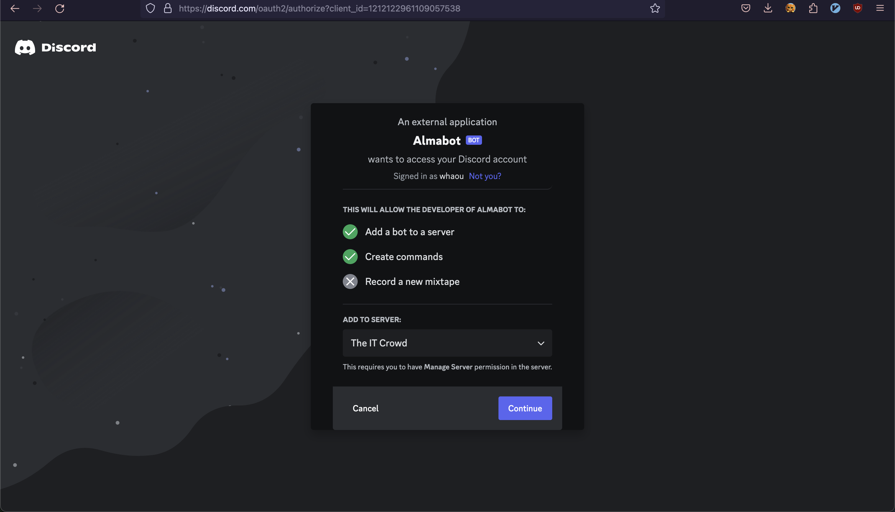

# Almabot !

Never forget an almanax again :)

## How to install ?

Use this [link](https://discord.com/oauth2/authorize?client_id=1212122961109057538)

choose the server you want to install the bot on then click on continue

and for finish click on authorize

## Availables commands

``/almanax``

You can also pick a date with day / month arguments

Ex: ``/almanax 28 07``

